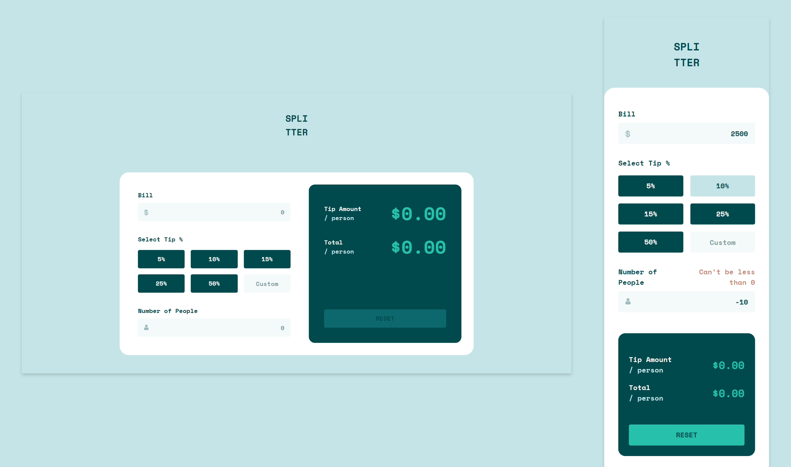

# Tip Calculator App

This is a solution to the Tip Calculator App challenge on
  <a href="https://www.frontendmentor.io/challenges/tip-calculator-app-ugJNGbJUX/hub" target="_blank">
    <strong>Frontend Mentor Challenge</strong>
  </a>

  <a href="#" target="_blank">💻 View Demo</a>
  &nbsp;·&nbsp;
  <a href="https://github.com/frontend-mentor-junior-projects/tip-calculator-app/issues" target="_blank">🐞 Report Bug</a>

<!-- Badges -->

  <!-- Profiles -->
  <!--
   &nbsp;&nbsp;&nbsp;
  -->

  <!-- Status -->
   &nbsp;&nbsp;&nbsp;

  <!-- Difficulty -->
  

## Preview

  

<h2>The Challenge</h2>
Users should be able to:
 
 
<ul>
  <li>-> View the optimal layout for the site depending on their device's screen size</li>
  <li>-> See hover states for all interactive elements on the page</li>
</ul>

## Built With

 &nbsp;  &nbsp;  &nbsp;  &nbsp;  &nbsp; 
